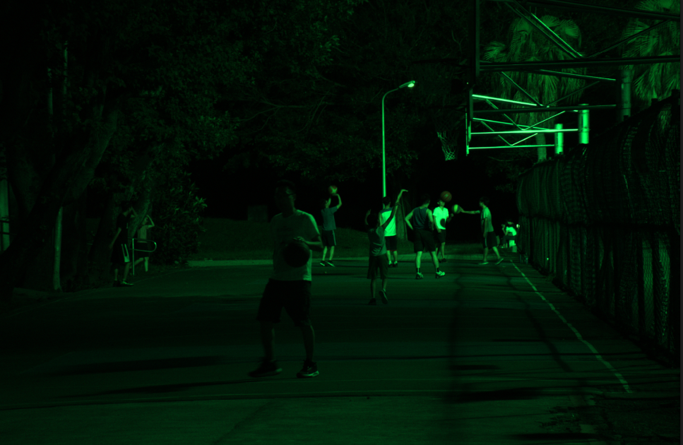

<h1 style="text-align: center;">GenISP: Neural ISP for Low Light Machine Cognition</h1>

<h3 style="text-align: center;">A reproduction by R. Revilla Llaca, V. Costa and P. Jain</h2>

<br><br>


## **Contents**
- [**Contents**](#contents)
- [**Introduction**](#introduction)
- [**Method Overview**](#method-overview)
- [**Preprocessing pipeline**](#preprocessing-pipeline)
  - [**Short Overview of RAW Files**](#short-overview-of-raw-files)
  - [**Packing**](#packing)
  - [**Averaging Greens**](#averaging-greens)
  - [**CST Matrix**](#cst-matrix)
  - [**Preprocessing Approach**](#preprocessing-approach)
- [**Image Enhancement**](#image-enhancement)
  - [**Resizing (Bilinear Interpolation)**](#resizing-bilinear-interpolation)
  - [**MLP**](#mlp)
  - [**Conv WB**](#conv-wb)
  - [**Conv CC**](#conv-cc)
  - [**Shallow ConvNet**](#shallow-convnet)
- [**Object Detector**](#object-detector)
- [**Training the Network**](#training-the-network)
  - [**Forward Pass**](#forward-pass)
  - [**Backpropagation**](#backpropagation)
  - [**Classification loss**](#classification-loss)
- [**Results**](#results)
- [**Discussion and Conclusion**](#discussion-and-conclusion)
***
<br>

## **Introduction**

Scientific publications should contain enough information (through explanations, diagrams, pseudocode, equations, etc) to allow reproductibility of the reported results with relatively low effort. While doing the reproduction, we underwent all sorts of challenges, including but not limited to:
* Lack of understanding of the problem
* Not enough information /details provided on the method
* No justifications provided for design decisions
* Versioning/legacy issues

Facing these challenges helped us understand what is needed to guarantee the reproductibility on the paper and the importance of correctly documenting and carefully explaining the details regarding the design and implementation of Deep Learning Models. The lessons learned in this project will be applied when performing our own research in the future. 


This blog post is a detailed review and reproduction log of the method utilized in [GenISP: Neural ISP for Low Light Machine Cognition](https://arxiv.org/abs/2205.03688). Its objective is to comprise the theoretical knowledge and practical considerations that we required in order to implement the method from scratch in Python ([preprocessing](https://github.com/rorevillaca/GenISP) and [main method](https://colab.research.google.com/drive/1obws31nGbWPPG2ggn0C4Snk0hpwnyOIU?usp=sharing)). We also include some lessons learned along the way, and some explanations and diagrams that would have been useful during the reproduction process. By writing this blog, we encourage the idea that scientific research should be fully transparent and reproducible.

In the **Methods** section we explain each step of the model in a thorough and detailed way. We rely on textual descriptions and diagrams, and include code snippets when we consider it necessary. We also emphasize what are the input and the outputs of each step. In the **Results** section we report the performance obtained by our model, comparing it to the results from the original paper. Finally, the **Conclusions/Dicussion** section contains our results interpretation along with insights, difference sources, limitations and additional work that could further improve our reproduction. 

<br><br>

## **Method Overview**

GenISP is a neural Image Signal Processor (ISP) able to enhance RAW image files as inputs to pretrained object detectors. The method avoids fine-tuning to specific sensor data by leveraging image metadata along with the RAW image files to transform the image to optimize object detection. The method consists of a preprocessing pipeline, followed by a color processing stage carried out by two networks (ConvWB and ConvCC) and a brightness enhancement carried out by a shallow ConvNet. The method is illustrated below:


## **Preprocessing pipeline**

### **Short Overview of RAW Files**
RAW is a class of computer files containing all the information available to a camera sensor when the shutter is clicked. This information is usually split into two files: the image data, that represents the light intensity and color of a scene in pixels, and the metadata containing the contextual information of the image. 


As opposed to processed filetypes (such as JPEG or PNG), RAW files are larger in size and are not directly recognizable to the human eye, but allow for a more granular and tehnical manipulation of the information. In order to process the image, both the metadata and pixel information must be combined. 

The structure of a RAW file changes from manufacturer to manufacturer, and even between camera models. For this explanation we will focus on .ARW files, which are the RAW files produced by Sony Alpha cameras, as this is the format for the provided training data. The pixel information in .ARW files is stored in an m-by-n array, where each pixel contains the information from a unique color channel (red, green or blue). The image metadata contains information about the pattern, which will help us process the image as described in the article:

```python
with rawpy.imread('DSC01375.ARW') as raw:
    print(f'File pattern: {raw.raw_pattern.tolist()}')
    print('Color description: ', raw.color_desc)
```
This outputs:
```
File pattern: [[0, 1], [3, 2]]
Color description:  b'RGBG'
```
As can be seen, the information for each pixel is contained in contiguous 2-by-2 arrays Furthermore, the sensor for the camera contains twice as many pixels for green than for blue or red. This is common in Bayer sensors because the human eye is more sensitive to variations in shades of green. The green color values are stored in positions "1" and "3" (that is, the upper right and lower left positions of each array). Red and blue values are stored in the "0" (upper left) and "2" (lower right) positions respectively. 


### **Packing**

The goal of packing (also known as demosaicing) is to extract the information for each color channel into its own array. The dimensions of the resulting arrays will be half of those in the original (RAW) array. The packing procedure for the red channel is illustrated below. 


To pack the RAW images, we can simply subset the values according to their index and store them in an array for each channel.

### **Averaging Greens**

In the paper the green channels are averaged linearly, resulting in the standard RGB channels. This process is shown below: 


### **CST Matrix**

As a last preprocessing step, the image is converted to the XYZ color space. As the paper explains, converting the images to this device-independent color space ensures that the method generalizes to unseen camera sensors. The transformation is performed by applying the CST matrix, which is included within the image metadata. 

To apply the CST matrix, it must be multiplied by the values for every pixel in the image. In order to do this, only the first three rows (corresponding to the R,G,B channels) are considered. Below is the CST matrix for some models of Sony Alpha cameras:

```python
CTS Matrix:
[[ 1.0315 -0.439  -0.0937]
 [-0.4859  1.2734  0.2365]
 [-0.0734  0.1537  0.5997]
 [ 0.      0.      0.    ]]
```
 
### **Preprocessing Approach**

The following function is used to preprocess the images:
```python
def pack_avg_cst(raw_filename):
    with rawpy.imread(raw_filename) as raw:
        # Get raw image data
        image = np.array(raw.raw_image, dtype=np.double)

        # Get the raw pattern of the photo
        n_colors = raw.num_colors
        colors = np.frombuffer(raw.color_desc, dtype=np.byte)
        pattern = np.array(raw.raw_pattern)
        i_0 = np.where(colors[pattern] == colors[0])
        i_1 = np.where(colors[pattern] == colors[1])
        i_2 = np.where(colors[pattern] == colors[2])

        # Pack image and average green channels
        image_packed = np.empty((image.shape[0]//2, image.shape[1]//2, n_colors))
        image_packed[:, :, 0] = image[i_0[0][0]::2, i_0[1][0]::2]
        image_packed[:, :, 1]  = (image[i_1[0][0]::2, i_1[1][0]::2] + image[i_1[0][1]::2, i_1[1][1]::2]) / 2
        image_packed[:, :, 2]  = image[i_2[0][0]::2, i_2[1][0]::2]

        # CST Conversion
        cst = np.array(raw.rgb_xyz_matrix[0:3, :], dtype=np.double)        
        # Matrix-vector product for each pixel
        image_sRGB = np.einsum('ij,...j', cst, image_packed)

```


In order to reduce computational load, a subset of 100 images was selected from the provided dataset (wighting over 50GB). The preprocessing stage for these images was performed locally, and the result was uploaded to Google Collab, where the rest of the method was implemented. At this point, color correction and brightness of the images has not yet taken place, making them look dark and greenish:



___

## **Image Enhancement** 

The enhancement pipeline is composed of three different Neural Networks: ConvWB, ConvCC and a shallow ConvNet. The first two networks have an almost identical linear structure, and learn parameters to tune the white balance and color correction of the image. The shallow ConvNet is non-linear, aiming to tune the visibility (brightness) of the image. 

Although ConvCC and ConvWB could be combined into a single network, the method treats them separately  aiming to improve each individual optimization.

### **Resizing (Bilinear Interpolation)**
For ConvWB and ConvCC, the input images are reduced to a 256x256 pixel resolution. This is done so as to decrease hardware load; the white balancing and color correction aspects of the image shouldn't be impacted much due to this size reduction but more by its overall statistical structure which is kept even after resizing. 

### **MLP**
The (Multi Layer Perceptrion) MLP is a standard fully connected neural network. In this method, it is used as the last layer for the ConvCC and ConvWB networks. Its architecture allows to define the number of scalar vectors, a feature that results useful in the context of these networks. Our implementation of the MLP is based on the inbuilt Pytorch class: 
```python

from torchvision.ops import MLP
  class WBNet(nn.Module):
    .
    .
      .
        self.mlp = MLP(in_channels = 64, 
        hidden_channels = [3])
        .
        .
        .
        h = self.mlp(h)
        return h
```
The hidden_channels argument is used to tune the length of the output vector (number of scalars it outputs). 

### **Conv WB**

ConvWB focuses on the white balancing of the input image. The NN predicts gain for each color channel of the input and controls to adjust global illumination levels and white balance of the image.
ConvWB implements an image-to-parameters network illustrated below. 


ConvWB takes in the resized image and implements an MLP in its last layer to output a vector of 3 weights. These are arranged in the diagonal of a 3 × 3 diagonal WB matrix. This matrix is applied to the image by multiplying it by the value for each pixel:


Below is the torch implementation of these operations:
```python
wb = WBNet() #WBNet follows the architecture defined in the paper
wb.to(torch.double)
output = wb(resized_image) #ConvWB applied to a resized (256x256) version of the image

output = torch.mean(output, 0) 
output = torch.diag(output) #Vector arranged into a 3x3 matrix

img = prep_image
img = img.to(torch.double)
new_image_wb = torch.matmul(img, output) #Each pixel is multiplied by the resulting matrix
```

### **Conv CC**
ConvCC follows ConvWB and is used to color correct the image. The network's architecture is identical to ConvWB's, except for the number of outputs it produces. While ConvCC just white balances every channel, this network has to color correct it. This is done by implementing an MLP which outputs a 9-value vector. These values are arranged into a 3x3 matrix and multiplied by the current version of the image. This operation is expressed as:


We hypothesize that the order of the scalars on the matrix has no effect on the output of the model, as long as this arrangement is consistent across the passes through the network. The code for the application of this network is presented below: 

```python
cc = CCNet()
cc.to(torch.double)
output = cc(resized_image)
output = torch.mean(output, 0)
output = output.reshape(3,3)
# new_image_wb is the white balanced full size image
img = new_image_wb

new_image_cc = torch.matmul(img, output)
# We apply permutations for comaptibility between the shallow ConvNet and CCNet
new_image_cc = new_image_cc.permute(0, 3, 1, 2)
```


### **Shallow ConvNet**
The shallow ConvNet is the last step in the enhancement pipeline. In contrast with the two previous NNs, this model is applied directly to the current version to the image, transforming it directly. The architecture is illustrated below:


The shallow ConvNet enhances the brightness of the image through a non-linear transformation. This module concentrates the majority of the parameters of the model as it considers the entire image (i.e. without size reductions). This network increases the number of output channels before finally converging helping the it focus on structures in the image which otherwise are hard to find. A summary of the network follows: 
```python
----------------------------------------------------
Layer (type)        Output Shape           Param #
====================================================
Conv2d-1          [ -1, 16, 1834, 2750]    448
InstanceNorm2d-2  [-1, 16, 1834, 2750]     0
Conv2d-3          [-1, 64, 1832, 2748]     9,280
InstanceNorm2d-4  [-1, 64, 1832, 2748]     0
Conv2d-5          [-1, 3, 1832, 2748]      195
====================================================
Total params: 9,923
Trainable params: 9,923
Non-trainable params: 0
----------------------------------------------------
Input size (MB): 57.82
Forward/backward pass size (MB): 6262.89
Params size (MB): 0.04
Estimated Total Size (MB): 6320.75
----------------------------------------------------
```
The following methods are used to apply this network to the images: 

```python
final_images = ConvNet()
final_images.to(torch.double)
trained_image = final_images(new_image_cc)

```

We note that we were not able to perform the forward pass through the Shallow ConvNet due to the size of the images and the number of parameters this networks has. We first attempted to run the process locally and then in the Google Collab notebook, but the forward pass was enoough to exceed the provided resources. For this reason, the network is coded in the file but left out of the executions.

## **Object Detector**
The objective of GenISP is to restore and enhance low-light images so that they are optimal for cognition by any pre-trained off-the-shelf object detector. In order to learn to do so, GenISP is guided during training by an object detector. The object detector of our choice is a single-stage RetinaNet, an object detector model proposed in the paper Focal Loss for Dense Object Detection by Lin, Goyal et al.

Before deciding to use RetinaNet, we first attempted to use an OpenCV implementation of YoloV3 as our object recognition model. Although this model was very easy to use, it did not use PyTorch as its backbone and we had limited ability to modify it and to access its layers. As we realized that this could potentially block us during the implementation of the backpropagation mechanism, we decided to switch the model. 

The choice of RetinaNet was motivated by the fact that it was referenced as being the object detector used to train GenISP in the GenISP paper, and because an easy to read and to modify PyTorch implementation of RetinaNet was freely available in the following GitHub repository: https://github.com/yhenon/pytorch-retinanet. This version also contains an implementation of the loss functions cited in the GenISP paper, alpha-balanced focal loss and smooth L1 loss.

Although the code in the repository is dated and does not run as is, few modifications were necessary to repair it. We tested it by first giving it sample images from the internet, on which it succesfully recognized different objects:


Above each bounding box is the label of the recognized object followed by its confidence score. 

***
## **Training the Network**

### **Forward Pass**

As mentioned earlier, the preprocessing of the images was performed locally to reduce the online resources needed for the implementation. The preprocessed images are downloaded in the notebook and run through the ConvWB and ConvCC architectures (after the necessary rescaling).  

Due to the memory issues regarding the Shallow ConvNet, the transformed output of ConvCC is input directly to the object detector model. By displaying the resulting images along with bounding boxes drawn over them, we were able to observe that our ISP pipeline was producing images that could be used for cognition. 


***
### **Backpropagation**

After the forward pass is complete, loss can be calculated with respect to the object recognition model's output. Loss can be minimized by making increments to the parameters of the neural network (weights and biases) that go against the gradient of the loss with respect to those parameters. As the value of the loss represents classification and regression error, adjustments that lead to its diminution imply the production of images that are more suitable for the object recognition model.

### **Classification loss**

Classification loss is modeled by alpha-balanced focal loss:


where y ∈ {±1} specifies the ground-truth class, p ∈ [0, 1] is the model’s estimated probability for the class with label y = 1 and γ ≥ 0 is a tunable focusing parameter.

Focal loss is an extension to cross-entropy loss in which a modulating factor (1 − pt)^γ is added to reduce the impact of class imbalance. Easily classifiable negative examples tend to comprise the majority of the loss and to dominate the gradient, so down-weighting their impact allows the training to focus on the hard negatives.

Alpha is a factor between 0 and 1 that can be set as inverse class frequency or treated as a hyperparameter to be set by cross-validation.

### **Regression loss**

Regression loss is modeled by smooth L1-loss:


Where a squared term is used if the absolute element-wise error falls below a beta parameter and an L1 term is used otherwise. It is less sensitive to outliers than mean squared error loss and in some cases prevents exploding gradients.

Both loss functions were already implemented in Yan Henon's RetinaNet implementation:


***
## **Results**

The constraints posed by the memory limitations prevent us from running the network with more than 5 images at a time. This averts us from training the network with the provided training set (+2,500 images). A workaround is to reduce the image size, or to convert it to a smaller format (such as .png), but this defeats the objective of the paper, which is to leverage the raw image values and metadata to replace a predefined ISP. We therefore rely on the succesfull forward and backward pass for a small batch of images from the train set.    

***

## **Discussion and Conclusion**
This project provides the code and documentation used to reproduce the GenISP method. By reproducing the original paper, we applied the core concepts of the course (particularly CNNs) to develop a working Neural architecture. The overall process encouraged us to deeply understand the method (and the assumed background knowledge), to question and understand its characteristics and considerations, and most importantly, to identify aspects that are crucial for scientific reproductibility. We acknowledge the do's (and don'ts) of scientific research communication. We hope that the detailed explanation, along with the code suffices for those who wish to understand, reproduce or extend this method.  